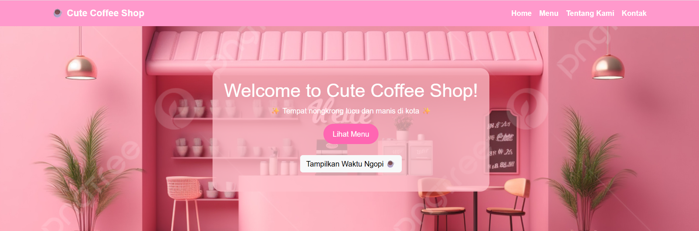
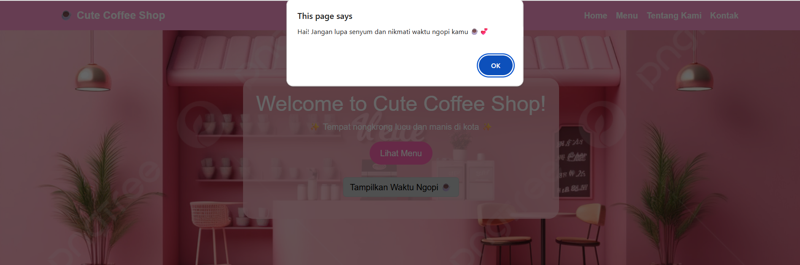
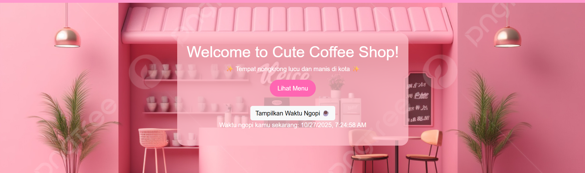
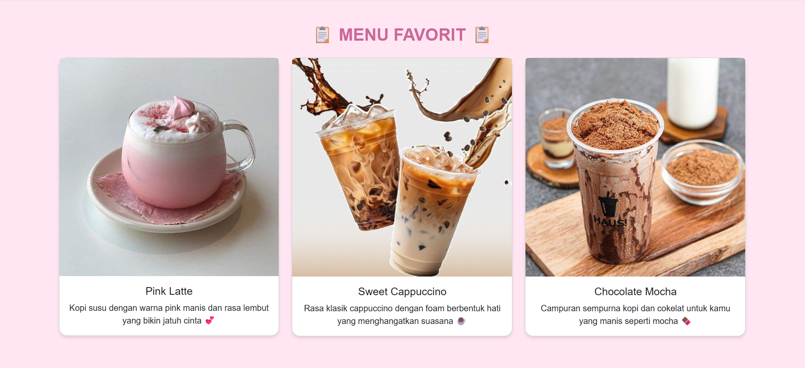
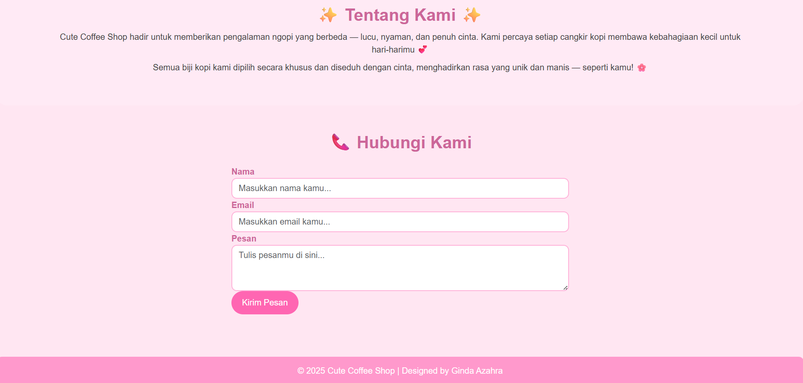

# ☕ Cute-Coffee-Shop
Website satu halaman bertema **coffee shop lucu dan manis** dengan warna **pink pastel**, dibuat sebagai tugas **Pemrograman Web 1**.

## 📋 Deskripsi singkat
**Cute Coffee Shop** dibuat untuk memberikan suasana ngopi yang hangat dan ceria bagi semua orang.  
Website ini memiliki tampilan lembut dengan sentuhan warna pink pastel, serta interaksi sederhana menggunakan **JavaScript** untuk menampilkan waktu ngopi secara real-time.

## 🧱 Struktur Halaman  
- **Navbar** — menu navigasi ke *Home, Menu, Tentang Kami,* dan *Kontak*  
- **Hero Section** — gambar latar + teks sambutan + tombol interaktif JavaScript  
- **Menu Section** — menampilkan 3 menu kopi favorit  
- **About Section** — deskripsi singkat tentang kedai kopi  
- **Contact Section** — form untuk mengirim pesan  
- **Footer** — Nama Mahasiswa

## 🛠️ Teknologi yang Digunakan  
- **HTML5**  
- **CSS3** (Custom & Bootstrap 5.3.8)  
- **JavaScript** (untuk interaksi tombol)  
- Font dan styling custom  
- Gambar ilustrasi dari Pinterest

## ✨ Fitur Interaktif
Tombol “**Tampilkan Waktu Ngopi ☕**” di halaman utama akan:
- Menampilkan waktu dan tanggal saat ini di layar  
- Menampilkan alert pesan motivasi ngopi 

## 📸 Tampilan Website

### Tampilan Awal

### Daftar Produk

### Form Kontak

